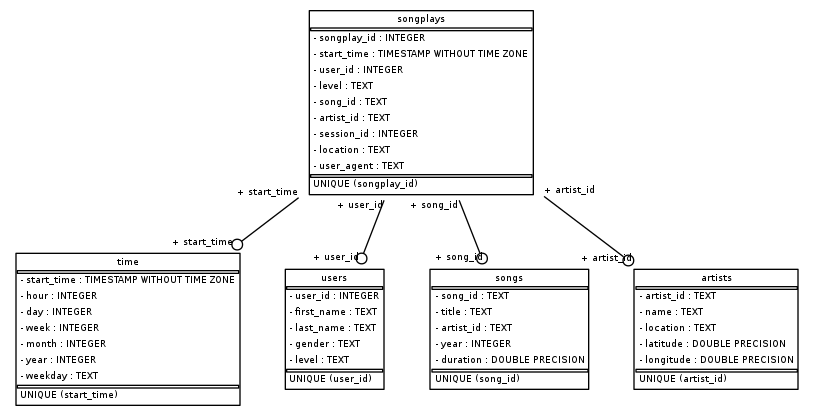

# Project: Data Modeling with AWS Redshift

## Table of content

1. [Describe](#Describe)
2. [Project Structure](#project)
3. [How to run](#run)
4. [Database Schema](#schema)

### Describe<a id='Describe'></a>

In this project, we will build a data warehouse in AWS Redshift for Sparkify - a start up company. With raw data has been saved at S3, we will copy this data into Redshift for future work(SQL query, analysis...).
We need to build a star schema database for song play dataset. This database have `songplay` as **fact table** and dimension table is: `users`, `songs`, `artists`, `time`.


### Project Structure<a id='project'></a>

```bash
├── ./create_tables.py # Initialze database, create and drop table in Redshift
├── ./etl.py # execute SQL query for copy and ETL data tables
├── ./README.md
├── ./sql_queries.py # Contains all sql query in this pipeline
├── ./dwh.cfg # Config Redshift connection and S3 storage
```

### How to run<a id='run'></a>
Step 1: Create tables in Redshift

```python
python create_tables.py
```

Step 2: Run ETL process and save data into into tables

```python
python etl.py
```


### Database Schema<a id='schema'></a>
