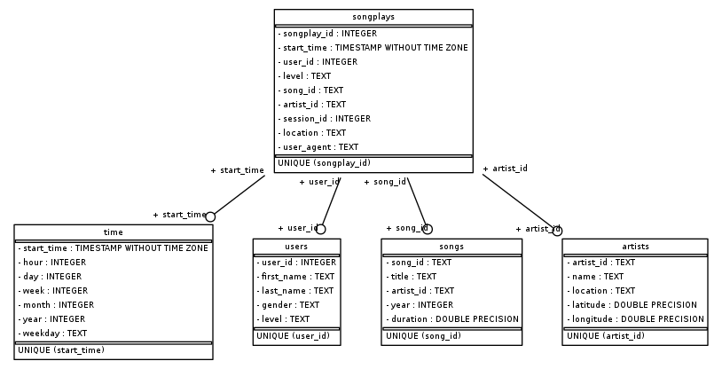

# Project: Data Modeling with Postgres

## Table of content

1. [Describe](#Describe)
2. [Project Structure](#project)
3. [How to run](#run)
4. [Database Schema](#schema)

### Describe<a id='Describe'></a>

Build a star schema database for song play analysis. This database have `songplay` as **fact table** and dimension table is: `users`, `songs`, `artists`, `time`.


### Project Structure<a id='project'></a>

```bash
├── ./create_tables.py # Initialze database, create and drop table
├── ./data # Folder contains song data and log data
│   ├── ./data/log_data
│   └── ./data/song_data
├── ./etl.ipynb # Jupyer notebook to examineETL process
├── ./etl.py # contains code for execute ETL song and log data
├── ./README.md
├── ./sql_queries.py # Contains all sql query in this pipeline
└── ./test.ipynb # Sanity tests of project
```

### How to run<a id='run'></a>
Step 1: Create database and all tables for project

```python
python create_tables.py
```

Step 2: Run ETL process and save data into database

```python
python etl.py
```


### Database Schema<a id='schema'></a>
